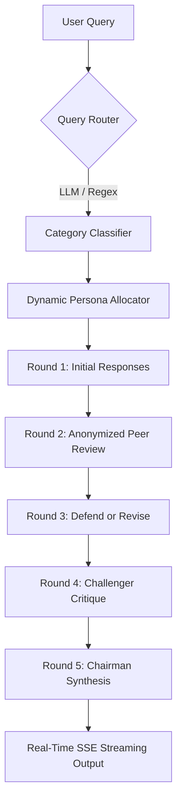

# ⚖️ debateX

**Enterprise-grade multi-LLM deliberation engine. Get council-vetted answers, not single-model guesses.**

[](LICENSE)
[](https://python.org)
[](https://reactjs.org)
[](https://fastapi.tiangolo.com)
[](https://groq.com)

---

## 🌟 Overview

**debateX** is a production-ready, self-hosted multi-LLM deliberation platform. Instead of trusting a single model's isolated perspective, **debateX** orchestrates a dynamic council of diverse language models (powered by **Groq** and **OpenRouter**). 

The platform passes query contexts through an advanced, anonymized multi-round cognitive debate structure, allowing models to cross-examine arguments, refine their logic, defend coordinates, and isolate potential flaws before a designated Chairman model delivers a beautifully synthesized final consensus.

---

## 🚀 Key Evolutionary Features

### 1. 🔄 Advanced 5-Round Deliberation Pipeline
The orchestration layer has been evolved from a simple linear flow into a rigorous **5-Round Deliberation Pipeline**:
* **Round 1 (Stage 1 - Respond)**: Council models generate independent, blind initial answers.
* **Round 2 (Stage 2 - Peer Review & Rank)**: Council answers are completely anonymized, and models evaluate and rank their peers' answers to eliminate provider bias.
* **Round 3 (Defend & Revise)**: Models are presented with the anonymous ranks, peer critiques, and their own positions, allowing them to defend their logic or revise their answers.
* **Round 4 (Challenger Critique)**: A dedicated council member is designated as the **Challenger**. Its sole task is to construct a rigorous critique isolating the absolute weakest points of the leading answers.
* **Round 5 (Stage 3 - Chairman Synthesis)**: The designated **Chairman (Moderator)** ingests the entire historical context of all four rounds to produce a high-confidence, comprehensive final response.

### 2. 🎭 Dynamic Cognitive Persona Allocation
Incorporates a deterministic **shift-based role rotation** engine (`backend/roles.py`) that assigns specific behavioral personas per query:
* **Reasoner (2-3 models)**: Drives deep analytical and conceptual logic.
* **Fact-Checker (1 model)**: Equipped with dedicated Google-search capability to verify data bounds.
* **Devil's Advocate (1 model)**: Challenges consensus and exposes hidden assumptions.
* **Steelmanner (1 model)**: Re-articulates and strengthens competing arguments for fair assessment.
* **Chairman (1 model)**: Orchestrates and synthesizes the discussion.

### 3. 🎯 Fast Dual-Path Query Routing & Cost Estimation
Features a highly optimized query router (`backend/router.py`) that:
* Classifies incoming requests into one of 5 categories: `technical/code`, `creative`, `factual/research`, `ethical/philosophical`, or `math/logic`.
* Runs a dual-path classification workflow (sub-second fast LLM classification, falling back gracefully to local regex keywords on network hiccups).
* Recommends optimal model subsets, calculates token consumption projections, and outputs a predicted USD cost per query using calibrated pricing parameters.

### 4. ⚡ Real-Time SSE Stream & Interactive UI
Upgraded to a high-speed Server-Sent Events (SSE) streaming API (`backend/main.py`) paired with an elegant, responsive React dashboard showcasing:
* Live-updating stages, active round transitions, and aggregate peer ranks.
* Markdown-supported raw outputs, peer critique maps, and detailed cost estimation widgets.
* Sleek glassmorphic theme styling with tailored error reporting panels.

---

## 🛠️ System Architecture & Workflow



---

## ⚙️ Supported Models

### **Groq Cloud API**
* `groq/llama-3.3-70b-versatile` (Primary Chairman & High-Performance Synthesis)
* `groq/openai/gpt-oss-120b` (Reasoning & Code Expert)
* `groq/qwen/qwen3-32b` (Precision Logic Node)
* `groq/llama-3.1-8b-instant` (High-Speed Processing)

### **OpenRouter API (Free Tier)**
* `deepseek/deepseek-v4-flash:free` (Default Moderator fallback)
* `z-ai/glm-4.5-air:free` (Diverse Context processing)
* `liquid/lfm-2.5-1.2b-instruct:free` (Lightweight semantic node)
* `nvidia/nemotron-3-nano-30b-a3b:free` (Logical extraction)

---

## 📥 Quick Start Setup Guide

Follow these steps to get your local environment configured and running in under **5 minutes**.

### 1. Prerequisite Installations
* **Python 3.11 or higher**
* **Node.js v18 or higher**
* **uv Package Manager** (highly recommended for sub-second Python dependency resolution)
  * Install `uv` via: `pip install uv` or `curl -sSf https://astral.sh/uv/install.sh | sh`

### 2. Clone & Setup Configuration
Clone the repository to your workspace:
```bash
git clone https://github.com/pvsaravanan/debateX.git
cd debateX
```

Create and configure your `.env` environment file:
```bash
cp .env.example .env
```

Open `.env` and fill in your API credentials:
```env
OPENROUTER_API_KEY=your_openrouter_api_key_here
GROQ_API_KEY=your_groq_api_key_here
```

---

## 🏃 Running the Application

### Method A: One-Click Launch (Recommended)

* **Windows**: Double-click [run.bat](file:///c:/proj/debateX/run.bat) from your file explorer, or run it in Command Prompt:
  ```cmd
  run.bat
  ```
* **macOS / Linux**: Grant execution permissions and run [start.sh](file:///c:/proj/debateX/start.sh):
  ```bash
  chmod +x start.sh
  ./start.sh
  ```

*These scripts automatically resolve dependencies (using `uv sync` & `npm install`), initialize local virtual environments, and boot up both the FastAPI backend server (port `8001`) and the Vite React frontend (port `5173`).*

---

### Method B: Manual Manual Commands

#### 1. Setup & Run the Backend
Using **`uv`** (Recommended):
```bash
# Sync dependencies and start uvicorn
uv sync
uv run python -m backend.main
```

Using standard **`pip`**:
```bash
# Create a virtual environment
python -m venv .venv
source .venv/bin/activate  # On Windows: .venv\Scripts\activate

# Install dependencies and run
pip install -r requirements.txt
python -m backend.main
```
*The backend server will run at: **http://localhost:8001***

#### 2. Setup & Run the Frontend
```bash
cd frontend
npm install
npm run dev
```
*The frontend development server will run at: **http://localhost:5173***

---

## 🧪 Running the Verification Test Suite

Verify all models, dynamic routing modules, cost calculations, and role assignments work flawlessly by running the unit test suite:

```bash
# Run all tests
uv run python -m unittest tests/test_roles.py tests/test_router.py

# Or run individual modules
uv run python -m unittest tests/test_roles.py
uv run python -m unittest tests/test_router.py
```

---

## 📖 Directory Structure

```text
├── .agent/               # Antigravity prompts and workflow integrations
├── backend/
│   ├── config.py         # Dynamic multi-provider model registrations
│   ├── debate.py         # Core 5-Round pipeline orchestration logic
│   ├── groq.py           # Groq API client interface
│   ├── llm.py            # Provider wrapper routing facade
│   ├── main.py           # FastAPI server & SSE streaming routing endpoints
│   ├── openrouter.py     # OpenRouter API client interface
│   ├── roles.py          # Dynamic role assignments & persona definitions
│   ├── router.py         # Category router, pricing table & cost calculations
│   └── storage.py        # Serialized JSON storage utilities
├── frontend/
│   ├── src/              # React components, style sheets, and pages
│   └── package.json      # Frontend package details
├── openspec/             # OpenSpec specifications library & changes archive
├── tests/                # Verification test suites
├── debateX.md            # Repository changes modification history logs
└── README.md             # Systems overview & guide
```

---

## ⚖️ License
Licensed under the [MIT License](LICENSE).