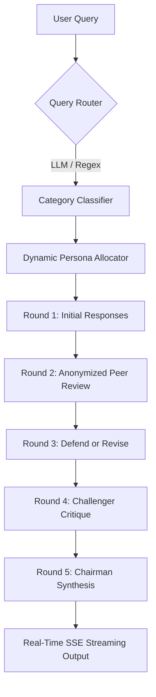

# debateX

**Enterprise-grade multi-LLM deliberation engine for council-vetted answers.**

[](LICENSE)
[](https://python.org)
[](https://reactjs.org)
[](https://fastapi.tiangolo.com)
[](https://groq.com)

---

## Overview

**debateX** is a production-ready, self-hosted multi-LLM deliberation platform. Instead of trusting a single model's isolated perspective, debateX orchestrates a dynamic council of diverse language models powered by Groq and OpenRouter.

The platform passes query contexts through an advanced, anonymized multi-round cognitive debate structure, allowing models to cross-examine arguments, refine their logic, defend coordinates, and isolate potential flaws before a designated Chairman model delivers a synthesized final consensus.

---

## Key Features

| Feature | Description |
|---------|-------------|
| **5-Round Deliberation Pipeline** | A rigorous pipeline including blind initial responses, anonymized peer review and ranking, logic defense and revision, challenger critique, and final synthesis by a Moderator. |
| **Dynamic Cognitive Persona Allocation** | A deterministic shift-based role rotation engine assigns specific behavioral personas per query (Reasoner, Fact-Checker, Devil's Advocate, Steelmanner, Chairman). |
| **Dual-Path Query Routing** | Fast query router classifies requests (technical, creative, factual, ethical, math), recommends optimal model subsets, and projects token consumption and cost. |
| **Real-Time SSE Stream** | High-speed Server-Sent Events (SSE) streaming API paired with a responsive React dashboard showcasing live-updating stages and peer ranks. |

---

## System Architecture & Workflow


```mermaid
graph TD
    UserQuery[User Query] --> Router{Query Router}
    Router -- LLM / Regex --> Classify[Category Classifier]
    Classify --> Assign[Dynamic Persona Allocator]
    Assign --> Round1[Round 1: Initial Responses]
    Round1 --> Round2[Round 2: Anonymized Peer Review]
    Round2 --> Round3[Round 3: Defend or Revise]
    Round3 --> Round4[Round 4: Challenger Critique]
    Round4 --> Round5[Round 5: Chairman Synthesis]
    Round5 --> SSE[Real-Time SSE Streaming Output]
```

---

## Supported Models

| Provider | Model | Primary Role / Capability |
|----------|-------|---------------------------|
| **Groq Cloud API** | `groq/llama-3.3-70b-versatile` | Primary Chairman & High-Performance Synthesis |
| **Groq Cloud API** | `groq/openai/gpt-oss-120b` | Reasoning & Code Expert |
| **Groq Cloud API** | `groq/qwen/qwen3-32b` | Precision Logic Node |
| **Groq Cloud API** | `groq/llama-3.1-8b-instant` | High-Speed Processing |
| **OpenRouter API** | `deepseek/deepseek-v4-flash:free` | Default Moderator fallback |
| **OpenRouter API** | `z-ai/glm-4.5-air:free` | Diverse Context processing |
| **OpenRouter API** | `liquid/lfm-2.5-1.2b-instruct:free` | Lightweight semantic node |
| **OpenRouter API** | `nvidia/nemotron-3-nano-30b-a3b:free` | Logical extraction |

---

## Quick Start Setup Guide

### 1. Prerequisites
- **Python 3.11+**
- **Node.js v18+**
- **uv Package Manager** (Recommended for rapid Python dependency resolution)
  - Install via: `pip install uv` or `curl -sSf https://astral.sh/uv/install.sh | sh`

### 2. Installation
Clone the repository:
```bash
git clone https://github.com/pvsaravanan/debateX.git
cd debateX
```

Configure your environment variables:
```bash
cp .env.example .env
```

Open `.env` and configure your API credentials:
```env
OPENROUTER_API_KEY=your_openrouter_api_key_here
GROQ_API_KEY=your_groq_api_key_here
```

---

## Running the Application

### Method A: Automated Startup Scripts
- **Windows**: Run `run.bat` from Command Prompt or double-click the file.
- **macOS / Linux**: Execute the shell script:
  ```bash
  chmod +x start.sh
  ./start.sh
  ```
*These scripts resolve dependencies (using `uv sync` & `npm install`) and start the FastAPI backend (port `8001`) and Vite React frontend (port `5173`).*

### Method B: Manual Execution

**Backend Setup (`uv`)**
```bash
uv sync
uv run python -m backend.main
```

**Backend Setup (`pip`)**
```bash
python -m venv .venv
source .venv/bin/activate  # Windows: .venv\Scripts\activate
pip install -r requirements.txt
python -m backend.main
```
*Backend server runs at **http://localhost:8001***

**Frontend Setup**
```bash
cd frontend
npm install
npm run dev
```
*Frontend development server runs at **http://localhost:5173***

---

## Verification Test Suite

Verify all models, dynamic routing modules, cost calculations, and role assignments by executing the unit test suite:

```bash
# Run all tests
uv run python -m unittest tests/test_roles.py tests/test_router.py

# Run individually
uv run python -m unittest tests/test_roles.py
uv run python -m unittest tests/test_router.py
```

---

## Directory Structure

| Path | Description |
|------|-------------|
| `.agent/` | Antigravity prompts and workflow integrations |
| `backend/` | Python/FastAPI backend logic |
| `backend/config.py` | Dynamic multi-provider model registrations |
| `backend/debate.py` | Core 5-Round pipeline orchestration logic |
| `backend/router.py` | Category router, pricing table & cost calculations |
| `frontend/` | React/Vite client application |
| `openspec/` | OpenSpec specifications library & changes archive |
| `tests/` | Verification test suites |

---

## License
Licensed under the [MIT License](LICENSE).