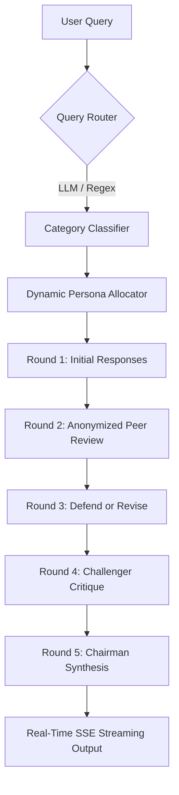

# debateX

**Enterprise-grade multi-LLM deliberation engine for council-vetted answers.**

[](LICENSE)
[](https://python.org)
[](https://reactjs.org)
[](https://fastapi.tiangolo.com)
[](https://groq.com)

---

## Overview

**debateX** is a production-ready, self-hosted multi-LLM deliberation platform. Instead of trusting a single model's isolated perspective, debateX orchestrates a dynamic council of diverse language models powered by Groq and OpenRouter.

The platform passes query contexts through an advanced, anonymized multi-round cognitive debate structure, allowing models to cross-examine arguments, refine their logic, defend coordinates, and isolate potential flaws before a designated Chairman model delivers a synthesized final consensus.

---

## Key Features

| Feature | Description |
|---------|-------------|
| **Query Classification** | Every query is routed first: a fast LLM classifier (with a local regex fallback) buckets it into technical/code, creative, factual/research, ethical/philosophical, or math/logic, and assembles a preference-ordered council of the best-fit models. |
| **Dynamic Persona Allocation** | A deterministic rotation engine assigns behavioral personas per query — Reasoner, Devil's Advocate, Fact-Checker, Steelmanner as council system prompts, plus a query-type-specific Chairman persona for synthesis. |
| **Anonymized Peer Review** | Council answers are re-labeled "Response A/B/C…" before ranking, so models evaluate arguments — not reputations. De-anonymization happens client-side, for display only. |
| **Challenger Critique** | The council's Devil's Advocate (or the worst-ranked model) is tasked with aggressively attacking the leading answer before synthesis. |
| **Real-Time SSE Stream** | Server-Sent Events stream every phase (`routing_*`, `round1_*`…`round5_*`) into a live-updating React dashboard with inspectable raw outputs. |
| **Cost Estimation** | The router projects the USD cost of the full deliberation from a per-model pricing table before Round 1 begins; free-tier models are costed at $0. |
| **Disagreement Analysis** | The Chairman emits a structured consensus/disagreement map (with per-model confidence scores) rendered as an interactive panel; a heuristic fallback covers unparseable output. |

---

## System Architecture & Workflow


```mermaid
graph TD
    UserQuery[User Query] --> Router{Query Router}
    Router -- LLM / Regex --> Classify[Category Classifier]
    Classify --> Assign[Dynamic Persona Allocator]
    Assign --> Round1[Round 1: Initial Responses]
    Round1 --> Round2[Round 2: Anonymized Peer Review]
    Round2 --> Round3[Round 3: Defend or Revise]
    Round3 --> Round4[Round 4: Challenger Critique]
    Round4 --> Round5[Round 5: Chairman Synthesis]
    Round5 --> SSE[Real-Time SSE Streaming Output]
```

---

## Configured Models

Models are registered dynamically in `backend/config.py` based on which API keys are present in `.env`:

| Provider | Model | Primary Role / Capability |
|----------|-------|---------------------------|
| **Groq Cloud API** | `groq/llama-3.3-70b-versatile` | Default Chairman & high-performance synthesis |
| **Groq Cloud API** | `groq/openai/gpt-oss-20b` | Reasoning node |
| **Groq Cloud API** | `groq/llama-3.1-8b-instant` | High-speed processing & query classification |
| **OpenRouter API** | `nvidia/nemotron-3-ultra-550b-a55b:free` | Deep reasoning (free tier) |
| **OpenRouter API** | `poolside/laguna-m.1:free` | Code specialist (free tier) |
| **OpenRouter API** | `google/gemma-4-31b-it:free` | Creative & diverse context (free tier) |
| **OpenRouter API** | `poolside/laguna-xs-2.1:free` | Lightweight code node (free tier) |

The query router selects a per-query council (max 4) from whatever is registered — swap models freely; routing preferences match on name substrings.

---

## Quick Start Setup Guide

### 1. Prerequisites
- **Python 3.11+**
- **Node.js v18+**
- **uv Package Manager** (Recommended for rapid Python dependency resolution)
  - Install via: `pip install uv` or `curl -sSf https://astral.sh/uv/install.sh | sh`

### 2. Installation
Clone the repository:
```bash
git clone https://github.com/pvsaravanan/debateX.git
cd debateX
```

Configure your environment variables:
```bash
cp .env.example .env
```

Open `.env` and configure your API credentials (at least one key is required):
```env
OPENROUTER_API_KEY=your_openrouter_api_key_here
GROQ_API_KEY=your_groq_api_key_here

# Optional: pre-flight self-consistency probing (3 samples per model at
# different temperatures). Off by default to stay inside free-tier rate limits.
ENABLE_METACOGNITION=false
```

---

## Running the Application

### Method A: Automated Startup Scripts
- **Windows**: Run `run.bat` from Command Prompt or double-click the file.
- **macOS / Linux**: Execute the shell script:
  ```bash
  chmod +x start.sh
  ./start.sh
  ```
*These scripts resolve dependencies (using `uv sync` & `npm install`) and start the FastAPI backend (port `8001`) and Vite React frontend (port `5173`).*

### Method B: Manual Execution

**Backend Setup (`uv`)**
```bash
uv sync
uv run python -m backend.main
```

**Backend Setup (`pip`)**
```bash
python -m venv .venv
source .venv/bin/activate  # Windows: .venv\Scripts\activate
pip install -e .           # dependencies are declared in pyproject.toml
python -m backend.main
```
*Backend server runs at **http://localhost:8001***. Always start it from the project root (the backend uses relative imports).*

**Frontend Setup**
```bash
cd frontend
npm install
npm run dev
```
*Frontend development server runs at **http://localhost:5173***

---

## Verification Test Suite

Verify all models, dynamic routing modules, cost calculations, and role assignments by executing the unit test suite:

```bash
# Run all tests
uv run python -m unittest tests.test_roles tests.test_router

# Run individually
uv run python -m unittest tests.test_roles
uv run python -m unittest tests.test_router
```

---

## Directory Structure

| Path | Description |
|------|-------------|
| `.agent/` | Antigravity prompts and workflow integrations |
| `backend/` | Python/FastAPI backend logic |
| `backend/config.py` | Dynamic multi-provider model registrations & feature flags |
| `backend/debate.py` | Single orchestrator (`run_debate_stream`) + all 5 round functions |
| `backend/router.py` | Query classifier, council selection, pricing table & cost estimation |
| `backend/roles.py` | Persona allocation engine (Reasoner, Devil's Advocate, Fact-Checker, Steelmanner, Chairman) |
| `backend/disagreement.py` | Chairman disagreement-map schema, parser & heuristic fallback |
| `backend/metacognition.py` | Optional self-consistency probing (behind `ENABLE_METACOGNITION`) |
| `frontend/` | React/Vite client application |
| `docs/` | API reference, deployment & development guides |
| `openspec/` | OpenSpec specifications library & changes archive |
| `tests/` | Verification test suites |

---

## License
Licensed under the [MIT License](LICENSE).