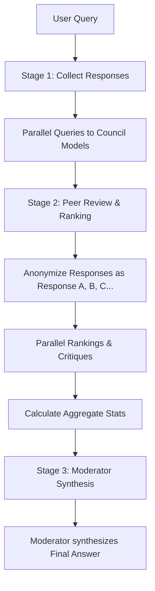

# DebateX Codebase Analysis

DebateX is a self-hosted, multi-LLM deliberation system designed to produce high-confidence answers by combining responses from a council of diverse models, collecting peer evaluations, and synthesizing them using a moderator/chairman model.

---

## 🏗️ Directory Structure

The project has a clean separation between the backend (FastAPI/Python) and the frontend (React/Vite).

```
debateX/
├── backend/                  # FastAPI Backend Orchestration
│   ├── config.py             # Model list, endpoint configs, data directories
│   ├── debate.py             # Core 3-stage orchestration and parsing logic
│   ├── groq.py               # Groq provider API client
│   ├── llm.py                # Facade mapping model names to Groq or OpenRouter
│   ├── main.py               # FastAPI web server and routing (SSE / streaming)
│   ├── openrouter.py         # OpenRouter provider API client
│   └── storage.py            # JSON conversation persistence (data/conversations)
├── frontend/                 # React Frontend Client
│   ├── src/
│   │   ├── components/       # UI Components (Sidebar, ChatInterface, Stages)
│   │   ├── App.css           # Global layout classes
│   │   ├── App.jsx           # Main state coordinator & SSE listener
│   │   ├── api.js            # HTTP and Server-Sent Events client
│   │   ├── index.css         # Global dark theme variables and typography
│   │   └── main.jsx          # React app entry point
│   ├── package.json          # Vite + React 19 dependencies
│   └── vite.config.js        # Vite config
├── tests/                    # Unit & integration testing scripts
├── run.bat                   # Windows batch script for one-click startup
└── start.sh                  # Unix/macOS startup script
```

---

## ⚙️ Core Architecture & Deliberation Pipeline

The core mechanism is a **Three-Stage Deliberation Pipeline** run asynchronously to minimize latency:



### 1. Stage 1: Collect Responses

- Queries all available council models in parallel (`asyncio.gather`).
- Returns raw outputs per model name.

### 2. Stage 2: Peer Review & Ranking

- Anonymizes the Stage 1 outputs under labels like `Response A`, `Response B`, etc.
- Asks all council models to evaluate and rank these responses without knowing which model generated them.
- Extracts rankings through structural parsing rules (`FINAL RANKING:\n1. Response X...`).
- Computes aggregate statistics (average position/rank, count of votes).

### 3. Stage 3: Moderator Synthesis

- Takes the original question, all Stage 1 responses, and all Stage 2 peer reviews.
- Feeds them to a designated Moderator (Chairman) model to produce a final comprehensive synthesis.

---

## 💻 Tech Stack & Design Decisions

### Backend

- **FastAPI**: Serving on port `8001` (to prevent conflicts with common port `8000`).
- **Uvicorn**: ASGI server.
- **Httpx**: Used for non-blocking asynchronous HTTP requests to OpenRouter and Groq.
- **Dynamic Configuration**: Council models and moderator configurations are loaded dynamically in `config.py` depending on which API keys are available in the `.env` file.
- **Storage**: Lightweight, file-based JSON persistence in `data/conversations/`.
- **Ephemeral Metadata**: Rankings mapping and statistical calculations are calculated live and returned to the client rather than stored in database files to save space.

### Frontend

- **React 19 & Vite 7**: Modern, high-performance React builds.
- **Server-Sent Events (SSE)**: Streams events (`stage1_start`, `stage1_complete`, `stage2_start`, etc.) via `api.sendMessageStream` to provide a real-time responsive chat interface.
- **ReactMarkdown**: Safely renders rich text, code fragments, and bullet points.
- **Styling**: Vanilla CSS utilizing dark mode variables (`--bg-primary: #171717`, `--accent-blue: #67e8f9`) for clean, modern visual styling.

---

## 📈 Data Flows

### Message Send & Stream Lifecycle

1. User types query and hits send.
2. React app creates a temporary assistant bubble showing pending state.
3. Call initiated to POST `/api/conversations/{id}/message/stream`.
4. Backend adds user message, starts asynchronous execution, and yields SSE chunks:
   - `stage1_start` / `stage1_complete`
   - `stage2_start` / `stage2_complete`
   - `stage3_start` / `stage3_complete`
   - `title_complete` (updates conversation title)
   - `complete` (finalizes stream)
5. Client captures events and progressively populates Stage components with tabbed selections.
